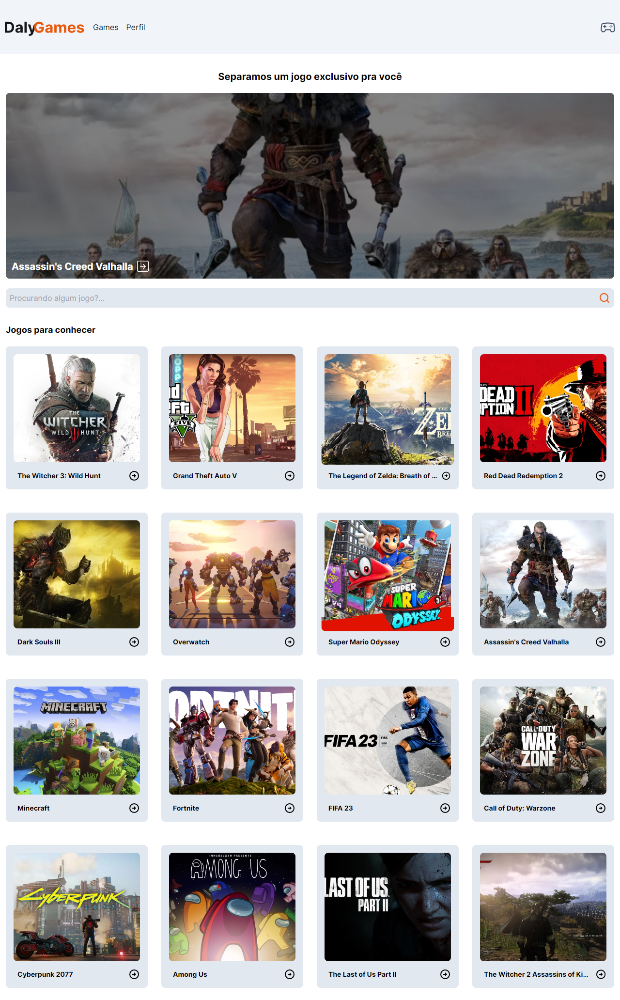
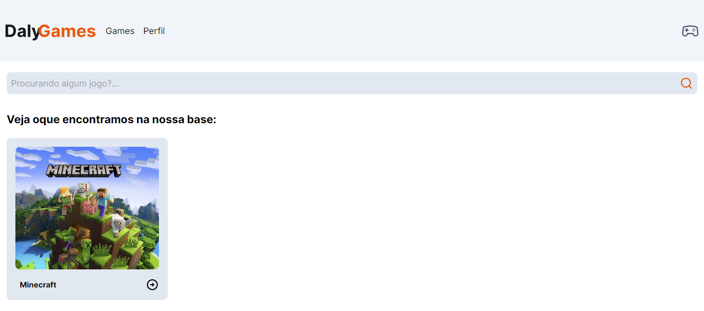
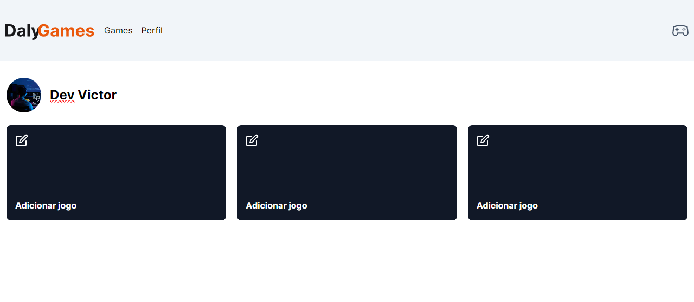

# Daly Game

Esse é um projeto utilizando NextJS, uma framework poderoso de ReactJS. Ambos derivados do JavaScript, consiste em um site simples para consumo de dados em um API e exibição para o user. 

Uma coisa muito interessante em trabalhar com NextJS é a mistura entre Client-Side e Server-Side, tornando muitas vezes a construção do site muito mais rápida por já ter dados prontos vindos do Server-Side.

Além do NextJS, também foi meu primeiro grande projeto usando TailwindCSS e Typescript.
## Aprendizados

- Trabalhar com Client-Side e Server-Side na mesma aplicação.

## Uso/Exemplos

### Routes

As rotas do NextJS são baseadas no React-Router-DOM, porém um pouco mais enrigecidas, por ser um framework, por ser um tanto complicado eu explicar a arquitetura completa das rotas apenas com trechos de código, deixo abaixo o link da documentação:

https://nextjs.org/docs/app/building-your-application/routing


### Interfaces

Foi muito interessante estudar e entender como funcionam as tipagens em Typescript, achei muito bacana a forma de construir uma interface e o quão útil são para por exemplo construir páginas a partir de dados HTTP.

```ts
export interface GameProps{
    id: number;
    title: string;
    description: string;
    image_url: string;
    platforms: string[];
    categories: string[];
    release: string;
}
```

### Tailwind

Na minha primeira impressão do Tailwind não foi tão mágica quanto todo mundo me pensar que seria, porém entendo seu valor e realmente acho que para projetos feitos em um curto prazo seja uma ótima alternativa. Também é bem verdade que ele contém alguns recursos bem úteis...
```ts
export default async function Home() {
  return (
    <main className="w-full">
      <Container>
        <h1 className="text-center font-bold text-xl mt-8 mb-5">
          Separamos um jogo exclusivo pra você
        </h1>
        <Link href={`/game/${dalyGame.id}`}>
          <section className="w-full bg-black rounded-lg">
            <div className="w-full max-h-96 h-96 relative rounded-lg">
              <div className="absolute z-20 bottom-0 p-3 flex justify-center items-center gap-2">
                <p className="font-bold text-xl text-white">{dalyGame.title}</p>
                <BsArrowRightSquare size={24} color="#FFF" />
              </div>

              <Image
                src={dalyGame.image_url}
                alt={dalyGame.title}
                priority={true}
                quality={100}
                fill={true}
                className="max-h-96 object-cover rounded-lg opacity-50 hover:opacity-100 transition-all duration-300"
                sizes="(max-width: 768px) 100vw, (max-width: 1200px) 44vw"
              />
            </div>
          </section>
        </Link>
        <Input/>

        <h2 className='text-lg font-bold mt-8 mb-5'>
          Jogos para conhecer
        </h2>
        <section className="grid gap-7 sm:grid-cols-2 md:grid-cols-3 lg:grid-cols-4">
          {games.map((item) => (
            <GameCard key={item.id} data={item} />
          ))}
        </section>

      </Container>
    </main>
  );
}

```

### Screenshots








## Autores

- [@Victor-Lis](https://github.com/Victor-Lis)

